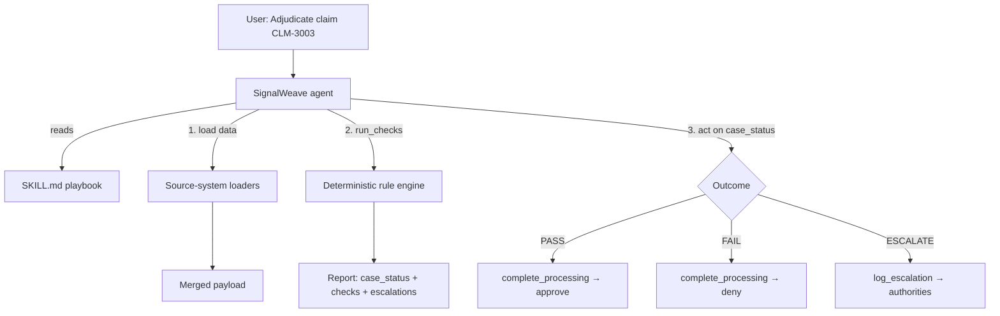

# How to Use SignalWeave

This guide explains how the SignalWeave agent works end to end, using the
**health insurance claim adjudication** process as a worked example. It shows how
the agent gathers data from multiple source systems, evaluates it deterministically
against declarative rules, and performs a terminal action (auto-approve, deny, or
escalate) for every outcome.

If you only want the rule syntax, see [`RULES_FORMAT.md`](RULES_FORMAT.md). This
document is about the *flow*: skill → loaders → checks → action.

---

## The mental model

SignalWeave separates three concerns so that **business behavior lives in data, not
code**:

| Layer | Where it lives | What it does |
| ----- | -------------- | ------------ |
| **Skill** | `signalweave/skills/<process>/SKILL.md` | A natural-language playbook the agent follows: which tools to call, in what order, and how to act on the result. |
| **Rules** | `signalweave/skills/<process>/references/rules.yaml` | The deterministic checks. Edited as YAML — no code changes. |
| **Tools** | `signalweave/tools/*.py` | Python functions the agent can call: data loaders, the `run_checks` engine, and the end-action tools. |

The agent itself never "judges" a case. It orchestrates tools; the rule engine
produces the verdict deterministically; an action tool carries out the decision.



---

## Worked example: health claim adjudication

Process name: **`health-claim-adjudication`**. The only input the user needs to
supply is a **claim id** (e.g. `CLM-1001`).

### Step 1 — The agent picks the skill

When the user mentions adjudicating a health/medical claim (or gives a claim id),
the agent loads [`signalweave/skills/health-claim-adjudication/SKILL.md`](../signalweave/skills/health-claim-adjudication/SKILL.md).
The skill's `description` frontmatter is what makes the agent choose it.

### Step 2 — Gather data from multiple source systems

A real claim record is not stored in one place. This process assembles it from
**five independent source systems**, each behind its own loader tool. Every loader
returns a single *namespaced slice*, so the field paths themselves reveal where each
value came from:

| Source system | Tool | Slice key | Looked up by |
| ------------- | ---- | --------- | ------------ |
| Claims Intake System | `load_claim` | `claim` | `claim_id` |
| Membership / Eligibility System | `load_eligibility` | `eligibility` | `member_id` |
| Provider Network & Pricing System | `load_provider` | `provider` | `provider_npi` |
| Utilization Management System | `load_authorization` | `authorization` | `claim_id` |
| Special Investigations / Fraud System | `load_fraud_signal` | `fraud` | `claim_id` |

*(Note: SignalWeave supports any number and **type** of source abstraction. Check out the `life-insurance-underwriting` skill, which demonstrates loading data concurrently from simulated in-memory dicts, REST APIs, SQL Databases, and local CSV files using the `DataSource` layer in `signalweave/sources/`.)*

The agent calls `load_claim` first; the returned `claim` slice carries the
`member_id` and `provider_npi` it then uses to fan out to the other systems. This
mirrors how a production agent would cross-reference records keyed differently in
each system.

### Step 3 — Assemble one payload

The slices are merged under a single `data` object. The namespacing keeps each
system's data isolated and traceable:

```json
{
  "data": {
    "claim":         { "claim_id": "CLM-3003", "member_id": "M-330987", "provider_npi": "1730024856", "service_date": "2026-05-28", "billed_amount": 18750.00, "...": "..." },
    "eligibility":   { "coverage_status": "active", "coverage_effective_date": "2026-01-01", "coverage_termination_date": "2026-12-31" },
    "provider":      { "in_network": true, "allowed_amount": 19000.00 },
    "authorization": { "prior_authorization_required": true, "prior_authorization_number": null, "medical_necessity_flag": true, "clinical_review_id": null },
    "fraud":         { "score": 84 }
  }
}
```

### Step 4 — Run the checks deterministically

The agent calls the `run_checks` tool with `process = "health-claim-adjudication"`
and the merged payload. The engine evaluates the 12 rules in
[`references/rules.yaml`](../signalweave/skills/health-claim-adjudication/references/rules.yaml)
and returns a report. Two rules deliberately compare values that come from
**different** source systems:

- **H005** — service date (Claims) must fall inside the coverage window (Eligibility).
- **H008** — billed amount (Claims) must not exceed the contracted allowed amount (Provider Network).

Each rule's `severity` decides what a failure means: `fail` denies the claim,
while `escalate` routes it to a named `authority`. The overall `case_status` is
`ESCALATE` if any check escalates, else `FAIL` if any fails, else `PASS`.

### Step 5 — Perform the terminal action

This is the key part: **every outcome ends in a concrete action**, via a tool. The
skill instructs the agent to call exactly one action tool based on `case_status`:

| `case_status` | Tool called | What it represents |
| ------------- | ----------- | ------------------ |
| **PASS** | `complete_processing(outcome="pass", ...)` | Claim auto-approved for payment. |
| **FAIL** | `complete_processing(outcome="fail", ...)` | Claim denied and returned. |
| **ESCALATE** | `log_escalation(...)` | Each responsible authority is logged with the **full** case detail for review. |

Both action tools currently **log** the action (with a generated reference id) to
demonstrate feasibility — this is where real downstream processing (payment, denial
letter, case-management ticket) would be wired in. The escalation tool records one
audit entry per authority, each carrying the complete report and merged payload so
the authority has everything needed to dispose of the case.

### Step 6 — Render the result

Finally the agent reports the verdict using the output format in
[`instructions.txt`](../signalweave/instructions.txt), including which end action
was taken and its reference id.

---

## The three built-in scenarios

The loaders ship with three canned claims so you can see each path end to end:

| Claim id | Outcome | Why |
| -------- | ------- | --- |
| `CLM-1001` | **PASS** → approved | Clean claim; in-network; billed = allowed; low fraud score. |
| `CLM-2002` | **FAIL** → denied | Missing procedure code + incomplete documentation (H007); billed `1850` exceeds allowed `1600` (H008). |
| `CLM-3003` | **ESCALATE** | Prior auth required but missing (H009 → *Utilization Management*); billed `18750` over the `10000` auto-adjudication threshold (H010 → *Senior Claims Examiner*); fraud score `84` (H011 → *SIU*); flagged for medical necessity with no clinical review (H012 → *Medical Director*). |

### Try the rule engine without the agent

You can exercise the deterministic core directly:

```bash
# Confirm the rules are well-formed
python -m signalweave.checks --validate --process health-claim-adjudication

# See which fields the rules need (note the per-source namespacing)
python -m signalweave.checks --fields --process health-claim-adjudication

# Evaluate a merged payload and print the report
python -m signalweave.checks --process health-claim-adjudication --data payload.json --json
```

The CLI exit code reflects the verdict: `0` = PASS, `1` = FAIL, `3` = ESCALATE —
handy for CI or batch pipelines.

---

## How to adapt this pattern to a new process

1. **Create the skill** — `signalweave/skills/<process>/SKILL.md` with a
   `description` that states the trigger phrase, then a step-by-step playbook.
2. **Write the rules** — `references/rules.yaml`. Use `severity: fail` for hard
   stops and `severity: escalate` with an `authority` for human review. Namespace
   field paths by source system if you load from more than one.
3. **Add loaders** — one tool per source system, each returning a namespaced slice
   (`{"<slice>": {...}}`). Register them in `signalweave/tools/__init__.py` and add
   them to the `tools=[...]` list in `signalweave/app.py`.
4. **Reuse the action tools** — `complete_processing` (PASS/FAIL) and
   `log_escalation` (ESCALATE) are generic; just have the skill call them with your
   process name, work id, the `run_checks` report, and the merged payload as
   `case_detail`.
5. **Validate** — `python -m signalweave.checks --validate --process <process>`.

Because the verdict logic is data and the actions are tools, you can ship a whole
new automated process without touching the agent's reasoning loop.

---

## Writing rules with the expression syntax

For processes that involve **arithmetic, aggregations, or conditional checks**,
the expression form is often more readable than the structured tree. It is fully
backward-compatible — you can mix structured-form rules and expression-form rules
in the same `rules.yaml`.

### Quick-start examples

```yaml
# Presence
check: "data.policy_number is present"

# Arithmetic equality
check: "data.base_premium + data.rider_premium == data.total_premium"

# Aggregation
check: "sum(data.beneficiaries[].share_percentage) == 100"

# Quantifier
check: "all(data.beneficiaries where share_percentage > 0)"

# Conditional (ternary) — escalates only when the antecedent is true
check: "if any(data.beneficiaries where is_minor == true) then data.guardian_id is present"
severity: escalate
authority: Annuity Operations Supervisor
```

### How the `where` predicate works

Inside a `where` predicate, field paths are **element-relative** — they refer to
properties of the current array element, not to the top-level `data` object.

```yaml
# Correct: 'share_percentage' is a field on each beneficiary element
check: "all(data.beneficiaries where share_percentage > 0)"

# Correct: 'data.threshold' is a top-level field; the predicate can mix both
check: "any(data.beneficiaries where share_percentage > 10)"
```

For the full grammar, function list, operator precedence table, and the
structured ↔ expression equivalence table, see [`RULES_FORMAT.md`](RULES_FORMAT.md).

---

## Worked example: annuity beneficiary designation

Process name: **`annuity-beneficiary-designation`**. This process uses only the
expression form for all eight rules.

### Canned scenarios

| Request id | Outcome | Why |
| ---------- | ------- | --- |
| `BEN-PASS-001` | **PASS** | Two beneficiaries sharing 100 %; premium adds up; no minors. |
| `BEN-FAIL-001` | **FAIL** | Share percentages sum to 80 %, not 100 %. |
| `BEN-ESC-001`  | **ESCALATE** | Emma (minor, 100 %) has no `guardian_id` → escalates to Annuity Operations Supervisor. |

### Try it from the CLI

```bash
# Validate the expression-form rules
python -m signalweave.checks --validate --process annuity-beneficiary-designation

# See the fields the expressions reference
python -m signalweave.checks --fields --process annuity-beneficiary-designation

# Evaluate directly (pipe in a BEN-PASS-001 payload)
python -m signalweave.checks --process annuity-beneficiary-designation --data payload.json
```

The `load_beneficiary_case` tool returns the pre-built payload for each canned
request id, so you can exercise the full skill by asking the agent:

> "Run a beneficiary designation check for request BEN-ESC-001."

---

## Worked example: annuity full surrender

Process name: **`annuity-full-surrender`**. This process models a full surrender
(complete cash-out) of an annuity contract. Like the beneficiary process it uses
only the expression form, but its rules add **payout arithmetic** (the net
surrender value and net payout must reconcile) alongside tax and suitability
controls. The only input the user supplies is a **request id** (e.g.
`SURR-PASS-001`).

The `load_surrender_case` loader returns a payload whose `data` object already
carries every field the rules reference, so the agent passes it straight to
`run_checks(process="annuity-full-surrender", payload=...)`.

### What the rules reconcile

Two rules verify that the disbursement figures add up across the contract,
charges, and tax withholding:

- **`net-surrender-value-correct`** — `contract_value − surrender_charge +
  market_value_adjustment − outstanding_loan_balance == net_surrender_value`.
- **`net-payout-after-withholding`** — `net_surrender_value −
  federal_withholding − state_withholding == net_payout`.

Three rules route exceptions to a named authority instead of auto-deciding:

| Rule | Authority |
| ---- | --------- |
| `early-withdrawal-tax-review` (owner under 59½, no acknowledgement) | Annuity Tax Compliance Desk |
| `large-surrender-review` (contract value over the auto-process threshold) | Annuity Operations Supervisor |
| `replacement-suitability-review` (replacement / 1035 exchange, no suitability review) | Suitability Review Committee |

### Canned scenarios

| Request id | Outcome | Why |
| ---------- | ------- | --- |
| `SURR-PASS-001` | **PASS** | In-force contract; signed form; payout figures reconcile; owner is 67; amount under threshold. |
| `SURR-FAIL-001` | **FAIL** | Surrender form not signed; the stated `net_surrender_value` does not match the computed value. |
| `SURR-ESC-001`  | **ESCALATE** | Owner is 47 without a tax-penalty acknowledgement (Tax Compliance Desk); `$480,000` exceeds the auto-process threshold (Operations Supervisor); replacement flagged with no suitability review (Suitability Review Committee). |

### Try it from the CLI

```bash
# Validate the expression-form rules
python -m signalweave.checks --validate --process annuity-full-surrender

# See the fields the expressions reference
python -m signalweave.checks --fields --process annuity-full-surrender

# Evaluate directly (pipe in a SURR-* payload)
python -m signalweave.checks --process annuity-full-surrender --data payload.json
```

Or exercise the full skill by asking the agent:

> "Run a full surrender check for request SURR-ESC-001."
